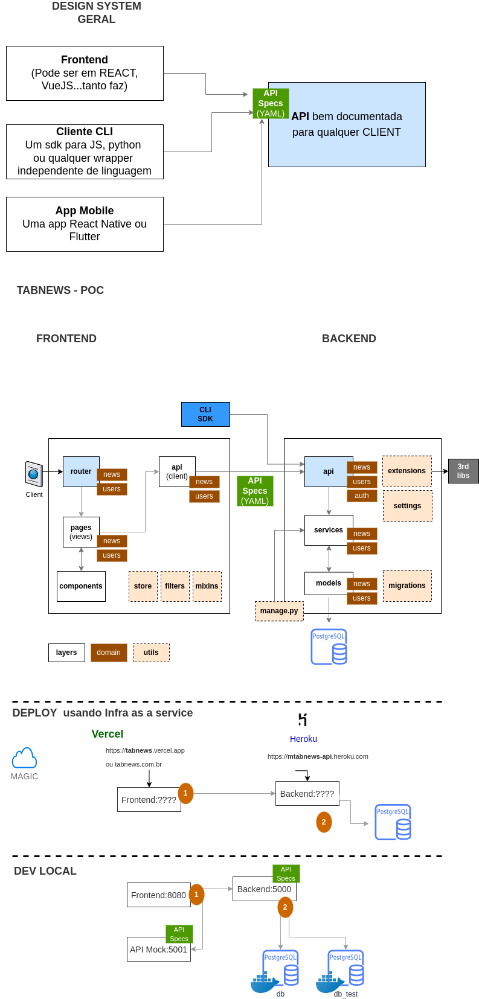

# tabnews-web

## Live demo

- Frontend: https://tabnews.vercel.app/
- Backend: https://tabnewsapi.herokuapp.com/api/

## Arquitetura

## Principais objetivos da separação Front/Back

- Alguns cenarios, inicialmente o frontend e backend evoluem
  juntos, depois eh comum por exemplo, o backend ficar estavel
  API e implementacao estarem com as funcionalidades necessarias E o frontend evoluir muito mais em termos
  de UI, UX e design mesmo...
  ou mesmo uma mudanca de web para nativo...
- podemos fazer 20, 30 deploys do frontend na semana e talvez 2 ou 3 deploys do backend no mesmo periodo

## Principais objetivos em termos de prioridades

- A abordagem principal aqui neste cenario nem eh definir
  uma arquivo em si.
- O principal objetivo mesmo eh conseguir ter uma
  arquitetura que promove focar no 'Business', ou seja,
  ao inves de focar no login, no cadastro de usuarios,
  no tipo de seguranca etc.. (que eh legal tambem), mas apenas
  um ponto de invertido, olhar do lado do produto. Desta forma, a ideia foi focar na listagem de tabnews, criar tabnews
- dai validar a ideia, imagina na primeira ou segunda semana
  a galera ja pode inserir, utilizar a plataforma.
- dai oq sera que vira prioridade? fazer comentario, conseguir dar uma reacao (positiva/negativa), mudar o visual
  pq nao esta dificil ver as noticias mais relevantes...saca?

## Por que VueJS?

- Nao consigo fazer em REACT ainda.... :/
  Eh um POC....entao no final do dia, nao importa muito o framework...

## Features

### FRONTEND

- Página home listando Tabnews (API Publica)
- Link para Login usando OAUTH/Github no backend python
- Link para criar nova Tabnews (protegida) via guardian.js
- Redireciona para login quando a API retorna 401 not authorized
- Salva login no local storage (JWT Token do usuário)
- ACT é feito com base no padrão do OAUTH / Scope (Ver backend)
- Mantem estado usando o token e o usuário com o local storage
- Usa o jwt-decode para extrair avatar, nome do token

A estrutura de pasta estah seguindo este template de Vuejs:

[https://github.com/huogerac/crud-vuetify-structured-template](https://github.com/huogerac/crud-vuetify-structured-template)

### BACKEND

- Flask como micro framework web
- Connexion para ter uma API enxuta e seguindo OpenAPI
- Design first API com documentação automática
- Migrations usando Alembic
- ORM usando SQLAlchemy (Facilita quem sabe SQL)
- Authlib para encapsular acesso OAUTH (Github)
- PyJWT para não precisar de tabela de sessão
- PyTest para documentar regras do negócio
  e facilitar o entendimento do código lendo testes

### Por que Python?

- Embora acho a Vercel, o NextJs do caramba! Ainda nao consigo
  entender muito bem fazendo um backend neste contexto de serveless
- Na minha ignorancia, me parece que algumas bibliotecas como de
  migrations e ORM, no Python estao mais maduras e completas...
- Escrever um teste de negocio, tal como, validar que apenas usuarios
  com 100 pontos podem fazer novos posts, e que criar um comentario gera
  12 pontos. Um teste deste em Python usando Pytest eh delicia de fazer,
  temos o business documentado em forma de teste de forma simples e rapida

### JWT NAAAAAOOOOOOOO!!!! ahhhhh

hehehe, nao se preocupe, eh que foi simples fazer com JWT, com pequenos
ajustes, da para ficar muito mais seguro ...
Tambem eh muito facil mudar para uma tabela de sessao e login retornando
um cookie ou qualquer outra forma....a abstracao q importa...

### Objetivo disto?

- Gerar alguns blog posts do backend python (OpenAPI)
- Não deixar o Filipe abandonar o Tabnews
- Quem sabe mostrar que python no backend é muito legal e tem bibliotecas completas
- Um frontend react acessando um backend pronto para producao em
  python iria deixar o Tabnews com um time to market muito melhor
  e a prova de falhas....hehehehe

  Arquitetura do Backend esta explicada aqui:
  [https://huogerac.hashnode.dev/estrutura-e-organizacao-de-pastas-em-projetos-flask](https://huogerac.hashnode.dev/estrutura-e-organizacao-de-pastas-em-projetos-flask)
