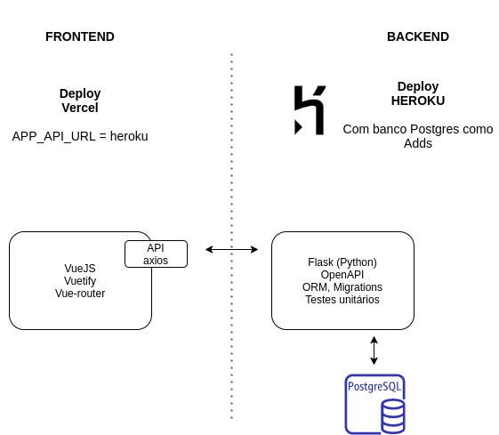

# tabnews-web

## Live demo

- Frontend: https://tabnews-web.vercel.app/
- Backend: https://tabnewspy.herokuapp.com/api/

## Arquitetura

## Features

### FRONTEND

- Página home listando Tabnews (API Publica)
- Link para Login usando OAUTH/Github no backend python
- Link para criar nova Tabnews (protegida) via guardian.js
- Redireciona para login quando a API retorna 401 not authorized
- Salva login no local storage (JWT Token do usuário)
- ACT é feito com base no padrão do OAUTH / Scope (Ver backend)
- Mantem estado usando o token e o usuário com o local storage
- Usa o jwt-decode para extrair avatar, nome do token

### BACKEND

- Flask como micro framework web
- Connexion para ter uma API enxuta e seguindo OpenAPI
- Design first API com documentação automática
- Migrations usando Alembic
- ORM usando SQLAlchemy (Facilita quem sabe SQL)
- Authlib para encapsular acesso OAUTH (Github)
- PyJWT para não precisar de tabela de sessão
- PyTest para documentar regras do negócio
  e facilitar o entendimento do código lendo testes

### Objetivo disto?

- Consolidar algumas tecnologias que venho estudando
- Gerar alguns blog posts do backend python (OpenAPI)
- Não deixar o Filipe abandonar o Tabnews
- Quem sabe mostrar que python no backend é muito legal e tem bibliotecas completas
